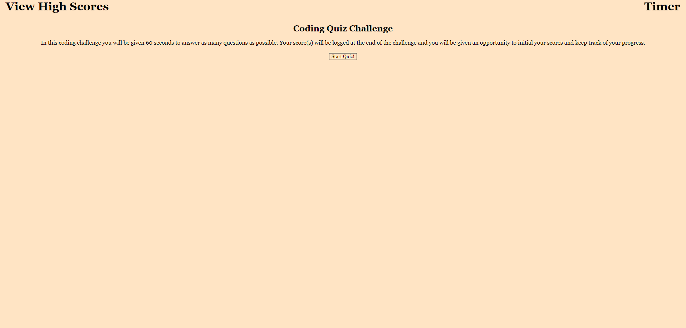
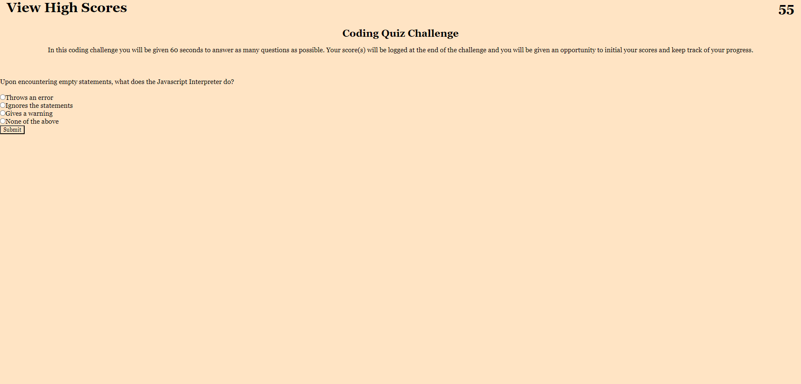
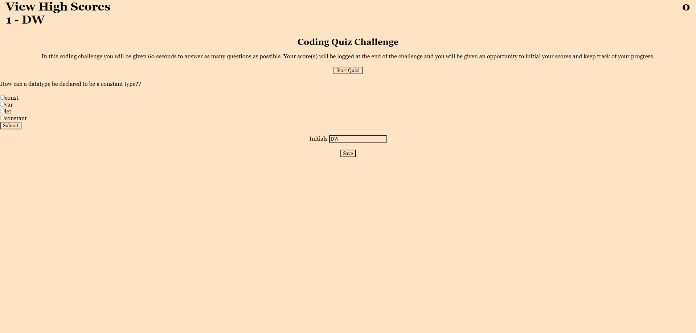

# javascript-fundamentals-quiz

javascript-fundamentals-quiz

## Link to Application

https://dan-watkins.github.io/javascript-fundamentals-quiz/

## Description

This application is a test of your JavaScript fundamentals. The test lasts either 60 seconds or until all available questions are answered.

Answering a question incorrectly subtracts 5 seconds from the available timer. Answering a question correctly adds a +1 to your score.

When the test is finished you can enter your initials and your initials plus your score will be logged to local storage and displayed in the top left corner of the screen, allowing you to keep track of your historical high scores as you take the test multiple times.

See below for an example of the Quiz in Progress.

When the test is over.

## Installation

Simply clone the repository. The current project is deployed using GitHub pages, which you will need to do as well.

- In the Settings for your respoitory scroll down to the 'Code and automation' section and find 'Pages.'

- Branch should be 'main.' Save.

- This step may take a moment to generate the page URL. Be patient.

- Once Page build and deploy is complete you should be able to access the site via <your-github-username.github.io/your-repository-name>.

## Credits

Special thanks to Trevor Tess, Nick Schulte, and Eric Dorsey for helping to keep me sane and assist with navigating DOM manipulation to accomplish this goal.
